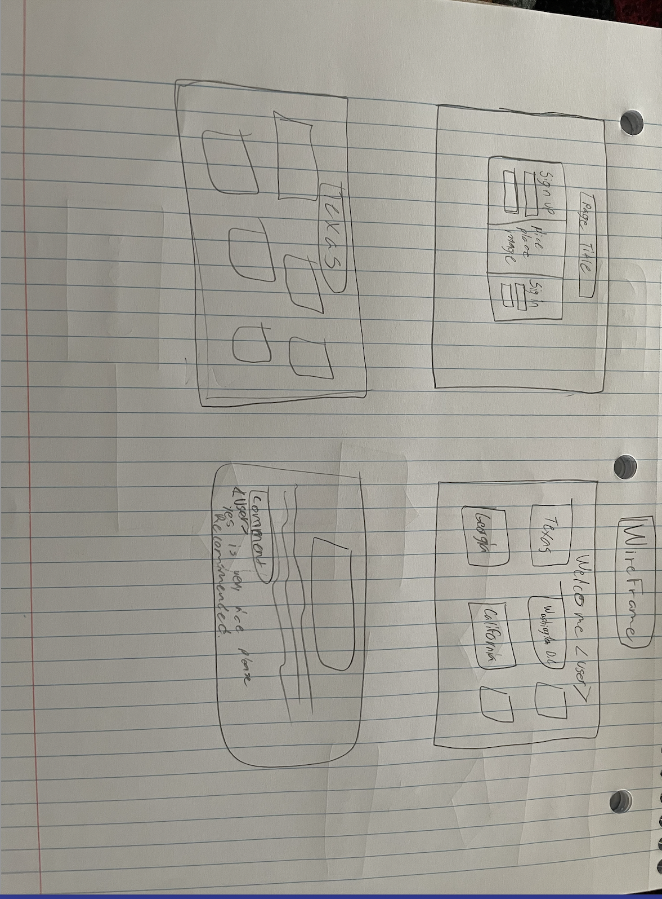
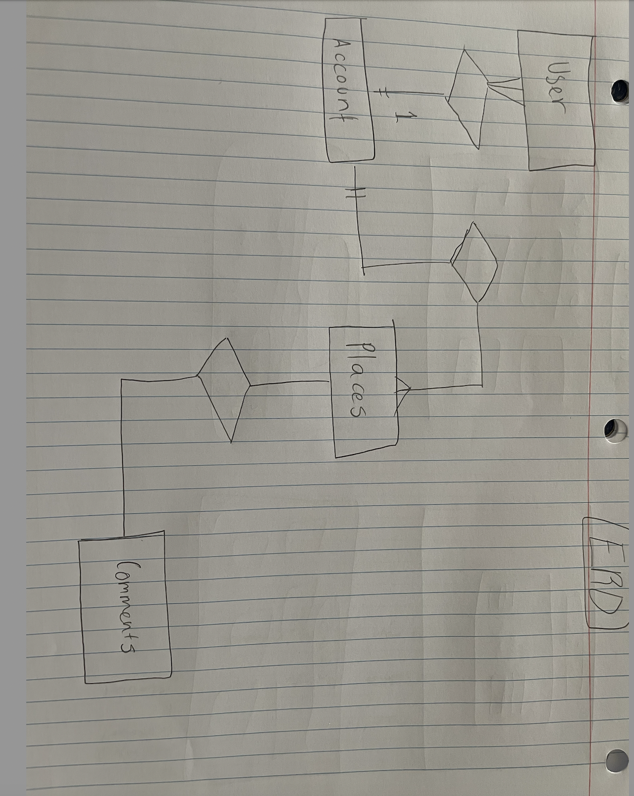

# friendlyPlace App

Friendlyplaces is a webpages based in different places to visit and to share with friends, user can check the different destination available through around the world.

## Important link

In the project directory, you can run:

Open [https://jovial-noyce-8e8aa9.netlify.app](https://jovial-noyce-8e8aa9.netlify.app)to view it in the browser.

## Technologies Used

- HTML/CSS
- Bootstrap
- Javascript
- React

### Wireframes

### Relations (ERD)

## [License](LICENSE)

1. All content is licensed under a CC­BY­NC­SA 4.0 license.
1. All software code is licensed under GNU GPLv3. For commercial use or
   alternative licensing, please contact legal@ga.co.
